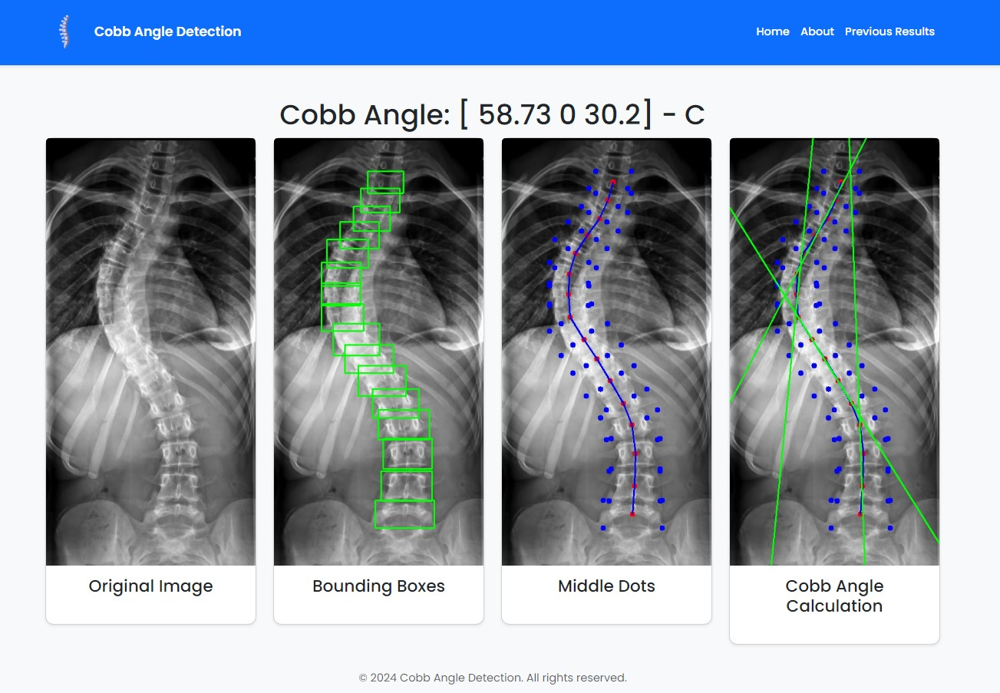

# Automated Scoliosis Analysis Tool with YOLO-based Vertebrae Detection

A web application that automatically detects vertebrae in spinal X-ray images and calculates Cobb angles to assist in scoliosis diagnosis. The tool combines deep learning-based vertebrae detection with precise geometric analysis to provide quantitative measurements of spinal curvature.

The application uses a pre-trained YOLO model to detect vertebrae in uploaded X-ray images and implements the Cobb angle measurement technique - the gold standard for evaluating scoliosis severity. It provides visual feedback by drawing bounding boxes around detected vertebrae, marking midpoints, and illustrating the calculated angles. The system can identify both C-type and S-type spinal curves, making it valuable for comprehensive scoliosis assessment.

## Repository Structure
```
.
├── app.py                 # Main Flask application with routing and core logic
├── cobb_angle.py         # Implementation of Cobb angle calculation algorithm
├── environment.yml       # Conda environment configuration
├── requirements.txt      # Python package dependencies
├── results.json         # Storage of analysis results
├── static/             # Static assets directory
│   ├── css/           # Stylesheet files
│   └── js/            # JavaScript files including loading indicator
└── templates/         # HTML templates for web interface
    ├── about.html     # About page template
    ├── index.html     # Main upload page template
    ├── partials/      # Reusable template components
    └── result.html    # Analysis results display template
```

## Usage Instructions
### Prerequisites
- Python 3.12.3
- Conda package manager
- CUDA-capable GPU (recommended for optimal YOLO model performance)
- Pre-trained YOLO models in `static/models/` directory

### Installation
```bash
# Clone the repository
git clone <repository-url>
cd <repository-name>

# Create and activate conda environment
conda env create -f environment.yml
conda activate scoliosis

# Alternative installation using pip
pip install -r requirements.txt
```

### Quick Start
1. Start the Flask application:
```bash
python app.py
```

2. Open a web browser and navigate to `http://localhost:5000`

3. Upload an X-ray image and select the appropriate YOLO model variant:
   - l-bestmodel: Large model for high accuracy
   - m-bestmodel: Medium model balancing speed and accuracy
   - n-bestmodel: Nano model for faster processing
   - x-bestmodel: Extra large model for maximum accuracy

4. View the analysis results showing:
   - Detected vertebrae with bounding boxes
   - Midpoint markers and connecting lines
   - Calculated Cobb angles
   - Curve type classification (C or S type)

### More Detailed Examples
```python
# Example of programmatic usage
from app import detect_vertebrae, calculate_cobb_angle

# Detect vertebrae in an image
image_path = "path/to/xray.jpg"
model_path = "static/models/l-best.pt"
detections = detect_vertebrae(image_path, model_path)

# Calculate Cobb angles
vertebrae_points = get_vertebrae_points(detections)
cobb_angles, angles_with_pos, curve_type, midpoint_lines = calculate_cobb_angle(
    vertebrae_points, 
    cv2.imread(image_path),
    "output_path.jpg"
)
```

## Screenshots
Here are some screenshots demonstrating the key features of the application:


*Main upload interface where users can select X-ray images and choose the YOLO model variant*


*Detection part!*


*Previous analysis results with timestamps and measurements*


*Detected vertebrae with bounding boxes drawn around them*
*Midpoint markers and connecting lines showing the spinal curve*

### Troubleshooting
Common issues and solutions:

1. Model Loading Errors
```bash
# Verify model files exist
ls static/models/*.pt

# Check model permissions
chmod 644 static/models/*.pt
```

2. Image Processing Failures
- Ensure X-ray images are in supported formats (JPG, PNG)
- Verify image resolution is adequate (recommended minimum 800x600)
- Check upload directory permissions:
```bash
chmod 755 static/uploads
```

3. Performance Issues
- Monitor GPU memory usage with:
```bash
nvidia-smi
```
- Adjust batch size in app.py if needed
- Consider using a lighter model variant

## Data Flow
The application processes X-ray images through a pipeline of vertebrae detection, midpoint calculation, and Cobb angle measurement.

```
[Upload] -> [YOLO Detection] -> [Midpoint Calculation] -> [Angle Analysis] -> [Result Storage]
   |             |                      |                        |                |
   v             v                      v                        v                v
Image File -> Bounding Boxes -> Vertebrae Points -> Cobb Angles -> JSON Results
```

Key component interactions:
1. User uploads X-ray image through Flask interface
2. YOLO model detects vertebrae locations
3. Application calculates midpoints of detected vertebrae
4. Cobb angle algorithm measures curve angles
5. Results are stored in JSON format with image paths
6. Processed images are saved with visual annotations
7. Web interface displays results and maintains history

